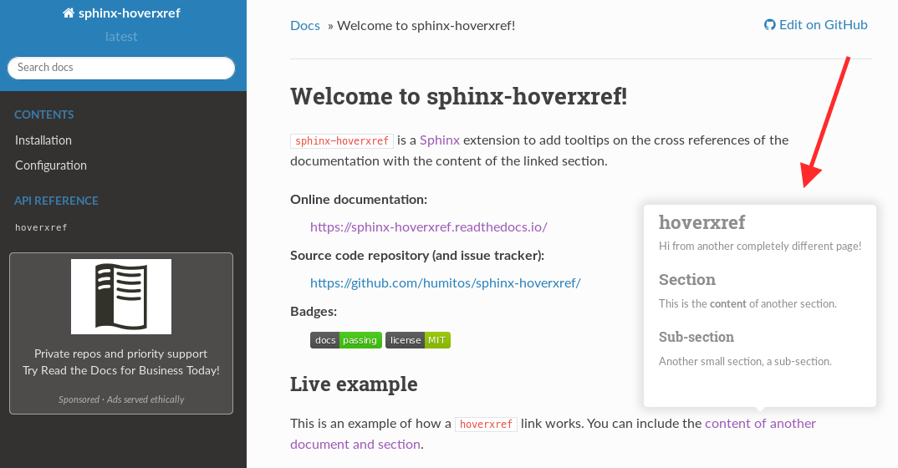

|Build| |PyPI version| |Docs badge| |License|

sphinx-hoverxref
================

``sphinx-hoverxref`` is a Sphinx_ extension to add tooltips on the cross references of the documentation with the content of the linked section.

.. warning::

    This extension is currently in Beta state.
    This means that there may be some things not well supported or unexpected behavior.
    If you find any issue, please `report it in the issue tracker <https://github.com/readthedocs/sphinx-hoverxref/issues>`_.

Example
-------

Installation
------------

You can install sphinx-hoverxref from PyPI:

::

   pip install sphinx-hoverxref

Or, alternatively, install it from GitHub directly (requires git):

::

   pip install git+https://github.com/readthedocs/sphinx-hoverxref@master

Configuration
-------------

Add this extension in your ``conf.py`` file as:

.. code-block:: python

   extensions = [
    # ... other extensions here

    'hoverxref.extension',
   ]

Documentation
-------------

Check out the full documentation at https://sphinx-hoverxref.readthedocs.io/

.. _Sphinx: https://www.sphinx-doc.org/

.. |Build| image:: https://travis-ci.org/readthedocs/sphinx-hoverxref.svg?branch=master
   :target: https://travis-ci.org/readthedocs/sphinx-hoverxref
   :alt: Build status
.. |PyPI version| image:: https://img.shields.io/pypi/v/sphinx-hoverxref.svg
   :target: https://pypi.org/project/sphinx-hoverxref
   :alt: Current PyPI version
.. |Docs badge| image:: https://readthedocs.org/projects/sphinx-hoverxref/badge/?version=latest
   :target: https://sphinx-hoverxref.readthedocs.io/en/latest/?badge=latest
   :alt: Documentation status
.. |License| image:: https://img.shields.io/github/license/readthedocs/sphinx-hoverxref.svg
   :target: LICENSE
   :alt: Repository license
