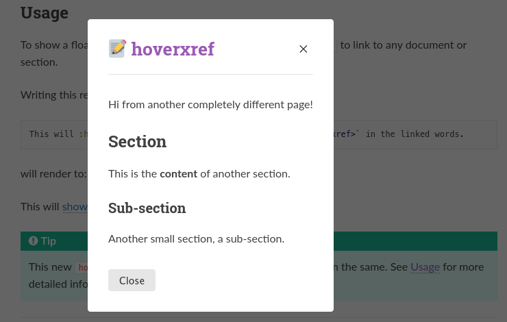

Welcome to sphinx-hoverxref!
============================

``sphinx-hoverxref`` is a Sphinx_ extension to show a floating window (tooltips or modal dialogues) on the cross references of the documentation embedding the content of the linked section on them. With ``sphinx-hoverxref``, you don't need to click a link to see what's in there.

We currently support two different types of floating windows: Tooltip_ and Modal_.

Tooltip
-------

By defining :confval:`hoverxref_type <hoverxref_type>` as ``'tooltip'`` (default) you will get a tooltip when hover references.

.. figure:: _images/tooltip-example.png
   :width: 75%
   :class: example

Modal
-----

By defining :confval:`hoverxref_type <hoverxref_type>` as ``'modal'`` you will get a modal when hover references.

Usage
-----

To show a floating window on a reference, use the role ``hoverxref`` to link to any document or section.

Writing this reStructuredText in your document:

.. code-block:: rst

   This will :hoverxref:`show a floating window <hoverxref:hoverxref>` in the linked words.

it will be rendered to:

This will :hoverxref:`show a floating window <hoverxref:hoverxref>` in the linked words.

.. tip::

   This new ``hoverxref`` role is an alias of the ``ref`` role and works in the same.
   See :ref:`usage:usage` for more detailed information about this and other examples.

----

Reference
---------

Online documentation:
    https://sphinx-hoverxref.readthedocs.io/

Source code repository (and issue tracker):
    https://github.com/readthedocs/sphinx-hoverxref/

Badges:
    |Build| |PyPI version| |Docs badge| |License|

.. toctree::
   :maxdepth: 2
   :caption: Contents

   installation
   usage
   configuration
   development

.. toctree::
   :maxdepth: 2
   :caption: API Reference

   autoapi/hoverxref/index

.. _Sphinx: https://www.sphinx-doc.org/
.. _Read the Docs: https://readthedocs.org

.. |Build| image:: https://travis-ci.org/readthedocs/sphinx-hoverxref.svg?branch=master
   :target: https://travis-ci.org/readthedocs/sphinx-hoverxref
   :alt: Build status
.. |PyPI version| image:: https://img.shields.io/pypi/v/sphinx-hoverxref.svg
   :target: https://pypi.org/project/sphinx-hoverxref
   :alt: Current PyPI version
.. |Docs badge| image:: https://readthedocs.org/projects/sphinx-hoverxref/badge/?version=latest
   :target: https://sphinx-hoverxref.readthedocs.io/en/latest/?badge=latest
   :alt: Documentation status
.. |License| image:: https://img.shields.io/github/license/readthedocs/sphinx-hoverxref.svg
   :target: LICENSE
   :alt: Repository license
